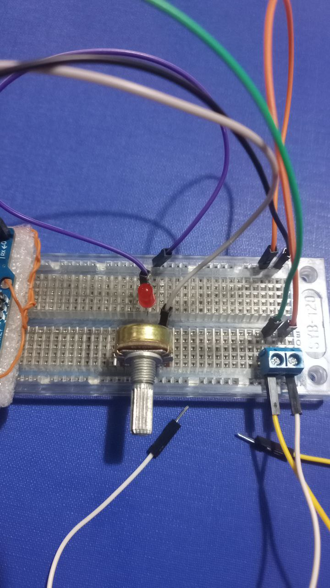

# midi_delirium

## Arduino MIDI Note Generator *( Controller V3 !!!)*
Este proyecto utiliza una placa Arduino y la librería MIDIUSB para generar notas MIDI al presionar un botón. Al presionar el botón, se toca una nota al azar, la cual dura entre 2 y 5 segundos. Si se vuelve a presionar el botón mientras la nota está sonando, se modifican algunas propiedades de la nota, como el tono (`pitch`) y la velocidad (`velocity`).

## Componentes

- Arduino (En este caso Leonardo) (compatible con la librería MIDIUSB)
- Botón (pulsador)
- LED (opcional)
- Resistor (10kΩ para el LED)
- Conexión USB a la PC para la salida MIDI

## Funcionamiento

### Funcionalidades principales:

1. **Generar una nota al azar**:
   - Al presionar el botón, se genera una nota MIDI aleatoria entre los valores de 22 y 107.
   - La nota dura entre 2 y 5 segundos de forma aleatoria.

2. **Modificación de propiedades**:
   - Si el botón se vuelve a presionar mientras la nota está activa, se cambian las propiedades de la nota (tono y velocidad) de manera aleatoria.

3. **Salida de MIDI**:
   - Las notas MIDI se envían por USB, lo que permite conectarse a software compatibles con MIDI en la PC. Por ejemplo LMMS, FLStudio, etc.

### Salida por consola (Serial):
El proyecto utiliza `Serial.print` para mostrar información de depuración sobre las notas generadas y sus modificaciones en la consola.

## Instalación

### Requisitos

- [Arduino IDE](https://www.arduino.cc/en/software)
- Librería [MIDIUSB](https://github.com/arduino-libraries/MIDIUSB)
  
### Configuración de hardware

1. **Botón**:
   - Conectar el pin del botón a `pin 2` del Arduino.

2. **LED (opcional)**:
   - Conectar un LED al `pin 9` del Arduino, con su correspondiente resistencia.

### Conexión MIDI

El Arduino enviará mensajes MIDI por USB a la PC. Asegúrate de que el software de música que uses esté configurado para recibir mensajes MIDI desde el dispositivo Arduino.

## Uso

1. Carga el código en el Arduino desde el IDE de Arduino.
2. Abre la consola serial para ver el estado de las notas generadas y sus propiedades.
3. Presiona el botón para generar una nota aleatoria. La duración de la nota será de entre 2 a 5 segundos.
4. Mientras la nota suena, presiona nuevamente el botón para cambiar el tono (`pitch`) y la velocidad (`velocity`) de la nota.

## Ejemplo de salida en consola

```plaintext
Note on: 96 for 4.21 seconds
Note modified: Pitch 96, Velocity 94
Note modified: Pitch 94, Velocity 50
Note modified: Pitch 95, Velocity 109
Note off: 95
Note on: 71 for 3.78 seconds
Note modified: Pitch 73, Velocity 80
Note modified: Pitch 72, Velocity 57
Note off: 72
```

### Sobre el controller v2
Es la version anterior ya testeada, no modifica notas, solo elige al azar.

## Seleccion de controllador MIDI en LMMS


## Imagenes de referencia con las conexiones




```
Los cables que salen de la bornera azul son el "boton"
```

# LMMS : Audio file Processor
Es super facil, aca lo explica muy bien.

Samplear con procesador de archivos de audio
```
https://www.youtube.com/watch?v=tSUlX3C2h6M
```